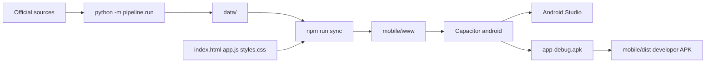
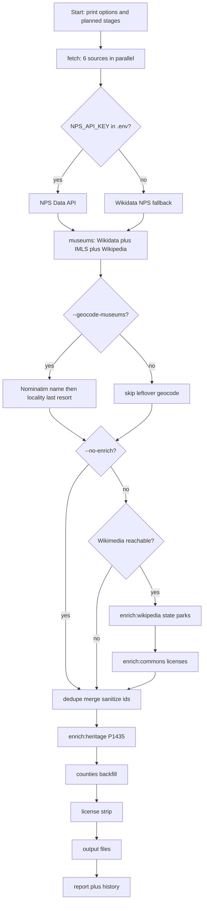

# Developer handbook

How to refresh landmark data, open the Capacitor project in Android Studio from
Cursor, build a debug APK, and export a sideloadable developer APK.

The product is the Android app. There is no hosted website.

## Prerequisites

Install once:

- **Python 3.10+** (pipeline is stdlib only)
- **Node.js 20+**
- **JDK 21** (Capacitor 8 / Android Gradle Plugin)
- **Android SDK** — Android Studio is easiest; needs platform `android-35+` and
  build-tools. Set `ANDROID_HOME` or `ANDROID_SDK_ROOT`.

Copy [`.env.example`](../.env.example) to `.env` in the repo root.

| Knob | Where | Why |
|---|---|---|
| `NPS_API_KEY` | `.env` | Secret. Free key from [NPS Developer](https://www.nps.gov/subjects/developer/get-started.htm). Without it, NPS units come from Wikidata. |
| `JAVA_HOME` | `.env` / shell | JDK 21 root (not `bin/`) for CLI Gradle. Typical Android Studio JBR on Windows: `C:\Program Files\Android\Android Studio\jbr` |
| `--no-enrich` | CLI | Per-run skip of post-fetch Wikipedia/Commons enrichment |
| `--geocode-museums` | CLI | Per-run Nominatim leftovers (slow, 429-prone). `MUSEUM_GEOCODE=1` in an existing `.env` is still honored. |
| `--verbose` | CLI | Also print `[debug]` merge/skip lines to stdout (debug is always written to the log file) |

`python -m pipeline.run --help` lists the flags.

## Open in Android Studio from Cursor

`mobile/android/` is gitignored. Generate it before opening Studio.

First time:

```bash
cd mobile
npm install
npm run add:android    # copy-web.mjs + cap add android
```

Every time after UI or `data/` changes:

```bash
cd mobile
npm run sync           # copy-web.mjs + cap sync
npm run open:android   # cap open android
```

In Cursor: **Command Palette → Tasks: Run Task → Open Android Studio**.

If Studio is already open: `npm run sync`, then Rebuild in Studio. Do not run
`cap add android` again.

## Run the pipeline

From the repo root (or `scripts/pipeline.sh` with the same arguments):

| Goal | Command |
|---|---|
| Routine rebuild | `python -m pipeline.run` |
| Skip Wikipedia/Commons (post-fetch) | `python -m pipeline.run --no-enrich` |
| Nominatim leftover museums | `python -m pipeline.run --geocode-museums` |
| Debug merge/skip lines | `python -m pipeline.run --verbose` |
| Official NPS units | set `NPS_API_KEY` in `.env` (not a CLI flag) |

Stage, ETA, and enabled options print to **stderr** and are teed into the rotating
log under `.cache/logs/pipeline-YYYYMMDD-HHMMSS.log` (last 10 kept). The pipeline
uses Python's `logging` module: named loggers (`pipeline`, `pipeline.stage`,
`pipeline.geocode`, …), a timestamped file formatter, and level filters.
`[info]` / `[warn]` / `[error]` go to stdout and the file. `[debug]` is always
written to the file; `--verbose` also prints it to stdout. Stage banners stay on
stderr (and the file) so they do not duplicate the stdout stream.

`--no-enrich` skips only the post-fetch Wikimedia stage (state-park summaries and
Commons image licenses). Museum Wikipedia work during fetch still runs.

`--geocode-museums` is not routine. After article and name lookups fail, a
city/township/county pin may be published with `location_quality=locality` and
an in-app warning.

Outputs land in `data/`. Review `data/DATA_REPORT.md` (fallbacks, changes since
last run) and `data/DATA_HISTORY.md`.

Cursor tasks: **Pipeline**, **Pipeline (--no-enrich)**, **Pipeline (--geocode-museums)**, **Pipeline (--verbose)**.

### Product loop



### Pipeline stages and knobs

Each diamond is the setting you control (CLI flag or `.env` key). Edges are yes/no.
Wikimedia reachability is a runtime check, not a flag.



## Build a debug APK

CLI (syncs UI + data first):

```bash
cd mobile
npm run apk:debug
```

Output: `mobile/android/app/build/outputs/apk/debug/app-debug.apk`

Android Studio: **Build → Build Bundle(s) / APK(s) → Build APK(s)**. Same output
path. Cursor task: **Debug APK**.

## Export a developer APK

This is the **debug-signed sideload APK**, not a Play Store build.

After a successful debug build:

```bash
cd mobile
npm run apk:export
```

Copies to `mobile/dist/MichiganLandmarks-debug.apk` (gitignored). In Studio, use
the locate link on the APK-generated notification, or copy from the Gradle
output path above.

On the device: allow installs from the app used to open the file, then tap to
install.

Play Store AAB, keystore, and listing: [`PLAYSTORE.md`](PLAYSTORE.md).

## Local UI preview

With `data/` present, from the repo root:

```bash
python -m http.server 8000
```

Open `http://localhost:8000/`. Development only — not a deployment path.

## Capacitor notes

App id and name live in [`mobile/capacitor.config.json`](../mobile/capacitor.config.json).
Change them **before** the first `npm run add:android`. See [`mobile/README.md`](../mobile/README.md).
