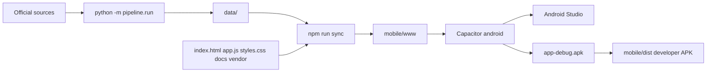
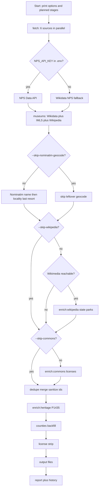

# Developer handbook

How to refresh landmark data, open the Capacitor project in Android Studio from
Cursor, build a debug APK, and export a sideloadable developer APK.

The product is the Android app. There is no hosted website.

## Prerequisites

Install once:

- **Python 3.10+** (pipeline is stdlib only)
- **Node.js 20+**
- **JDK 21** (Capacitor 8 / Android Gradle Plugin)
- **Android SDK** — Android Studio is easiest; needs platform `android-35+` and
  build-tools. Set `ANDROID_HOME` or `ANDROID_SDK_ROOT`.

Copy [`.env.example`](../../.env.example) to `.env` in the repo root.

| Knob | Where | Why |
|---|---|---|
| `NPS_API_KEY` | `.env` | Secret. Free key from [NPS Developer](https://www.nps.gov/subjects/developer/get-started.htm). Without it, NPS units come from Wikidata. |
| `JAVA_HOME` | `.env` / shell | JDK 21 root (not `bin/`) for CLI Gradle. `gradle-run.mjs` loads the repo-root `.env`, so Cursor **Build Debug APK** / `npm run apk:debug` do not need it in the task or shell. Typical Android Studio JBR on Windows: `C:\Program Files\Android\Android Studio\jbr` |
| `--skip-nominatim-geocode` | CLI | Skip leftover-museum Nominatim (slow, 429-prone). Wikipedia article coordinates still run during fetch. |
| `--skip-wikipedia` | CLI | Skip post-fetch Wikipedia summaries for state parks. Fetch-time museum Wikipedia still runs. |
| `--skip-commons` | CLI | Skip Wikimedia Commons image-license lookups. |
| `--quiet` | CLI | Stdout: warnings, errors, and the end-of-run summary. |
| `--silent` | CLI | Write nothing to stdout (log file still written). |
| `--export-gis` | CLI | Also write GeoJSON, CSV, and KML for QGIS / Google Earth / My Maps (not used by the APK) |
| `--output-dir DIR` | CLI | Write the dataset here instead of `data/` (Sync / the APK still read `data/`) |
| `--fresh` | CLI | Ignore HTTP and Nominatim caches and refetch (new results are still stored) |
| `--until STAGE` | CLI | Run through STAGE, write `.cache/checkpoint.json.gz`, stop |
| `--skip STAGE[,STAGE]` | CLI | Omit optional stages (`enrich:wikipedia`, `enrich:commons`, `enrich:heritage`, `counties`, `fetch:museum-geocode`). Cannot skip `license` or `dedupe` (prints the reason and exits 2). |
| `--from STAGE` | CLI | Resume from a checkpoint (must match the previous stage) |
| `--sources NAME[,NAME]` | CLI | Fetch a subset of sources (dataset marked incomplete) |

`python -m pipeline.run --help` lists the flags.

## Open in Android Studio from Cursor

`mobile/android/` is gitignored. Generate it before opening Studio.

First time:

```bash
cd mobile
npm install
npm run add:android    # copy-web.mjs + cap add android
```

Every time after Web UI or `data/` changes:

```bash
cd mobile
npm run sync           # copy-web.mjs + cap sync
npm run open:android   # cap open android
```

In Cursor: **Copy Web UI into Android**, then **Open Android Studio**.

If Studio is already open: **Copy Web UI into Android** (or `npm run sync`), then
Rebuild in Studio. Do not run `cap add android` again.

## Run the pipeline

From the repo root (or `scripts/pipeline.sh` with the same arguments):

| Goal | Command |
|---|---|
| Routine rebuild (app files, verbose stdout) | `python -m pipeline.run` |
| Also write GIS exports | `python -m pipeline.run --export-gis` |
| Write somewhere other than `data/` | `python -m pipeline.run --output-dir DIR` |
| Ignore caches | `python -m pipeline.run --fresh` |
| Skip leftover-museum Nominatim | `python -m pipeline.run --skip-nominatim-geocode` |
| Skip post-fetch Wikipedia summaries | `python -m pipeline.run --skip-wikipedia` |
| Skip Commons image licenses | `python -m pipeline.run --skip-commons` |
| Warnings + summary only | `python -m pipeline.run --quiet` |
| No stdout | `python -m pipeline.run --silent` |
| Stop after fetch (checkpoint) | `python -m pipeline.run --until fetch` |
| Resume after that checkpoint | `python -m pipeline.run --from enrich:wikipedia` (predecessor must match) |
| Official NPS units | set `NPS_API_KEY` in `.env` (not a CLI flag) |

A bare run does every stage and prints `[debug]` to stdout. Stage banners go to
**stderr** and the rotating log under `.cache/logs/pipeline-YYYYMMDD-HHMMSS.log`
(last 10 kept). The pipeline uses Python's `logging` module: named loggers
(`pipeline`, `pipeline.stage`, `pipeline.geocode`, …). `[info]` / `[warn]` /
`[error]` / `[debug]` go to stdout (unless `--quiet` or `--silent`) and the file.
`--quiet` keeps warnings, errors, and the end-of-run summary on stdout. `--silent`
writes nothing to stdout. The log file always gets DEBUG+. Stage banners stay on
stderr only when verbose.

`--skip-wikipedia` skips only the post-fetch Wikipedia summaries (state parks).
`--skip-commons` skips Commons image licenses. Museum Wikipedia work during fetch
still runs.

Leftover-museum Nominatim is on by default. After article and name lookups fail, a
city/township/county pin may be published with `location_quality=locality` and
an in-app warning. `--skip-nominatim-geocode` turns that pass off.

When sources change: re-run the pipeline and review `data/DATA_REPORT.md`. Do
not commit images or descriptions without provenance fields. The running app
does not call Nominatim. Pacing for leftover museum geocode is ≈2s between
requests with 429 backoff and a circuit breaker. Resolution order is Wikipedia
article coordinates, then Nominatim on the museum name, then a city/township/county
pin as last resort. Locality pins are published with `location_quality=locality`.

Repeat runs reuse `.cache/http/` (GET/POST bodies) and `.cache/nominatim/`. The
data report prints cache hit/miss counts. `--fresh` skips those reads.

`--export-gis` also writes GeoJSON, CSV, and KML for QGIS, Google Earth, and
My Maps. Default output is the Android dataset under `data/` (index + details +
report), which is enough for `npm run sync`. `--output-dir DIR` writes that
dataset elsewhere; Sync and the APK still read repo-root `data/`.

Cursor **Run Task** labels name the steps. Composites use `+`. The picker `detail`
line is the CLI. `--quiet` / `--silent` are not wired as tasks (default is verbose).

| Task | When |
|---|---|
| **Tests** | `python -m unittest discover -s tests -v` |
| **Host Web UI** | Serve `http://localhost:8000/` (does not open a browser) |
| **Pipeline** | Default rebuild: leftover Nominatim, Wikipedia, Commons → `data/` |
| **Pipeline (fast)** | `--skip-nominatim-geocode --skip-wikipedia --skip-commons` |
| **Pipeline + GIS exports** | `--export-gis` (QGIS / Google Earth / My Maps; not in the APK) |
| **Pipeline (--fresh)** | Default rebuild with `--fresh` (ignore HTTP/Nominatim cache reads) |
| **Pipeline (fast) + --fresh** | Fast skips plus `--fresh` |
| **Pipeline (Nominatim, Wikipedia, Commons) + Build Debug APK** | Default pipeline, then `npm run apk:debug` |
| **Pipeline (--fresh) + Build Debug APK** | `--fresh` rebuild, then `npm run apk:debug` |
| **Copy Web UI into Android** | `npm run sync` — copy-web + `cap sync` (no APK). **Build Debug APK** already does this. |
| **Open Android Studio** | `cap open android` |
| **Build Debug APK** | `npm run apk:debug` — copy into Android + `assembleDebug` |
| **Build Debug APK + Copy to dist** | Build, then `mobile/dist/MichiganLandmarks-debug.apk` |

**Pipeline (Nominatim, Wikipedia, Commons) + Build Debug APK** is the usual
maximal app rebuild: `python -m pipeline.run` (all sources, leftover Nominatim,
Wikipedia and Commons, `[debug]` on stdout, index + details + report), then
`npm run apk:debug` (copy into Android + Gradle `assembleDebug`). Same
debug-signed APK as Android Studio **Build → Generate App Bundles or APKs →
Generate APKs**: `mobile/android/app/build/outputs/apk/debug/app-debug.apk`.
Nominatim leftovers are slow and 429-prone; **Pipeline (fast)** skips them with
Wikipedia and Commons. Use **Pipeline (--fresh)** (or **Pipeline (fast) + --fresh**)
when you want to bypass `.cache/http/` and `.cache/nominatim/` reads.
`--export-gis` is not included in the APK composites (desktop GIS extras the
APK does not use).

### Product loop



### Pipeline stages and knobs

Each diamond is a skip you can pass. Edges are yes/no. Wikimedia reachability is
a runtime check, not a flag. A bare run takes the "no" (do the work) path.



## Build a debug APK

CLI (syncs Web UI + data first):

```bash
cd mobile
npm run apk:debug
```

Output: `mobile/android/app/build/outputs/apk/debug/app-debug.apk`

`JAVA_HOME` must be in the repo-root `.env` or the shell. Cursor **Build Debug APK**
does not source `.env` itself; `gradle-run.mjs` does.

Android Studio: **Build → Build Bundle(s) / APK(s) → Build APK(s)**. Same output
path. Cursor task: **Build Debug APK**.

## Export a developer APK

This is the **debug-signed sideload APK**, not a Play Store build.

After a successful debug build:

```bash
cd mobile
npm run apk:export
```

Copies to `mobile/dist/MichiganLandmarks-debug.apk` (gitignored). In Studio, use
the locate link on the APK-generated notification, or copy from the Gradle
output path above.

On the device: allow installs from the app used to open the file, then tap to
install.

Play Store AAB, keystore, and listing: [`PLAYSTORE.md`](PLAYSTORE.md).
User Help articles (including Legal & Privacy) live under [`docs/`](../) and are
bundled in the APK. This file and `PLAYSTORE.md` are not.

## Local Web UI preview

With `data/` present, from the repo root:

```bash
python -m http.server 8000
```

Open `http://localhost:8000/`. Development only — not a deployment path.

Cursor: **Host Web UI** (open `http://localhost:8000/` yourself). After Help docs or
Web UI edits, **Copy Web UI into Android** runs `npm run sync` so Android Studio
sees the shell; it does not compile an APK. **Build Debug APK** already copies first.

## Capacitor notes

App id and name live in [`mobile/capacitor.config.json`](../../mobile/capacitor.config.json).
Change them **before** the first `npm run add:android`. See [`mobile/README.md`](../../mobile/README.md).

## Docs and changelog

When a change would make a doc or changelog bullet wrong, update the matching
files in the same session:

- Users / in-app: `docs/` (except `docs/dev/`), `README.md`, `legal.html`, `CHANGELOG.md`
- Privacy / store: [`LEGAL.md`](../LEGAL.md), `legal.html`, this folder's `PLAYSTORE.md`, `THIRD_PARTY_NOTICES.md`
- Developers / agents: this file, `PLAYSTORE.md`, [`AGENTS.md`](../../AGENTS.md), `mobile/README.md`

Then add the notable change to [`CHANGELOG.md`](../../CHANGELOG.md) `[Unreleased]`.
If an older bullet is no longer true, leave it and add a new line that states
the correction. Cursor loads this from `AGENTS.md` and the Michigan Landmarks
project rule `.cursor/rules/session-docs.mdc`.
