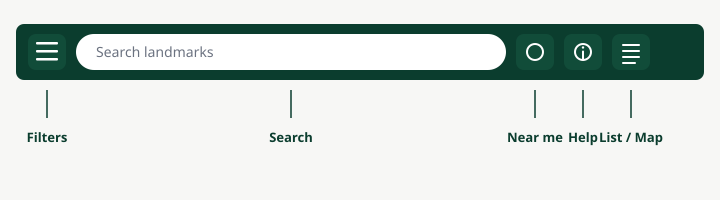
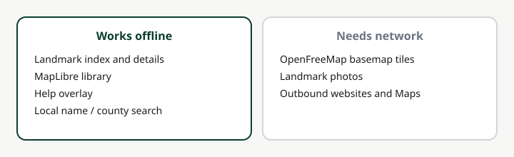

# Using the app

Header layout:

## Search

The search box filters the **bundled** landmark index (name, county, summary). Press Enter / the keyboard Search key to apply immediately and dismiss the keyboard. Search text is not sent to Nominatim or any geocoding service.

Clear (×) empties the query. A short hint appears when filters hide everything that matches.

[Focus search](app:search)

## Filters

[Open Filters](app:filters). A yellow dot on the button means you are not on the default filter set.

- **Categories** — lighthouses, historical markers, historic places (NRHP), state parks, national parks, museums. Show all / Hide all toggles every category.
- **Sort** — name, year newest, year oldest, or distance (after Near me).
- **Has photo only** — hides records with no photo URL.
- **Hide city/township pins** — hides pins whose location is a locality centroid, not the site.

Close with the drawer ×, the backdrop, or Escape.

## Map and list

[Map](app:map) uses MapLibre with OpenFreeMap tiles (OpenStreetMap data). Pins cluster when you zoom out.

[List](app:list) shows the same filtered set as cards. Tap a row for the same detail sheet as a pin.

## Near me

[Near me](app:locate) reads your location **on the device only** to center the map and enable distance sort. Deny the permission and you can still pan the map. Location history is not stored. See [Privacy](LEGAL.md#privacy).

## Detail sheet

Tap a pin or list row. On a phone, drag the handle upward to expand. On a wide screen the sheet sits as a side card.

Typical contents:

- Photo (hotlinked when online; not bundled in the APK)
- Name, category, year or listing date, county
- Approximate-location warning when the pin is not a site coordinate
- Plaque or description (two-sided markers show English on the card; other-language text in a labeled section)
- Address (tap to open maps; copy button)
- Open in Maps / Directions (GPS, name + address, or street address)
- Official website, Wikipedia, nomination/source links, Search the web
- Photo credit and data-source lines
- [Legal, privacy & sources](LEGAL.md) — in the app this stays inside Help

## Approximate pins

Some records are published with `location_quality`:

| Quality | Meaning |
|---|---|
| `site` | Source or article coordinates for the place |
| `name` | Geocoded from the name; may miss the building |
| `locality` | City, township, or county centroid (last resort) |

The detail card warns on `name` and `locality`. **Hide city/township pins** removes `locality` pins from the map and list.

## Offline and network

| Content | Offline? |
|---|---|
| Landmark index and detail text | Yes — bundled |
| MapLibre library | Yes — bundled |
| This Help overlay | Yes — bundled |
| Basemap tiles | No — OpenFreeMap when online |
| Photos | No — hotlinked when you open a record |
| Search | Yes — local filter |

## Outbound links

Official websites, Wikipedia, source/nomination pages, Search the web, and Maps/Directions open in the browser or maps app. This project does not operate those services. Attribution: [Legal & Privacy](LEGAL.md#sources).
